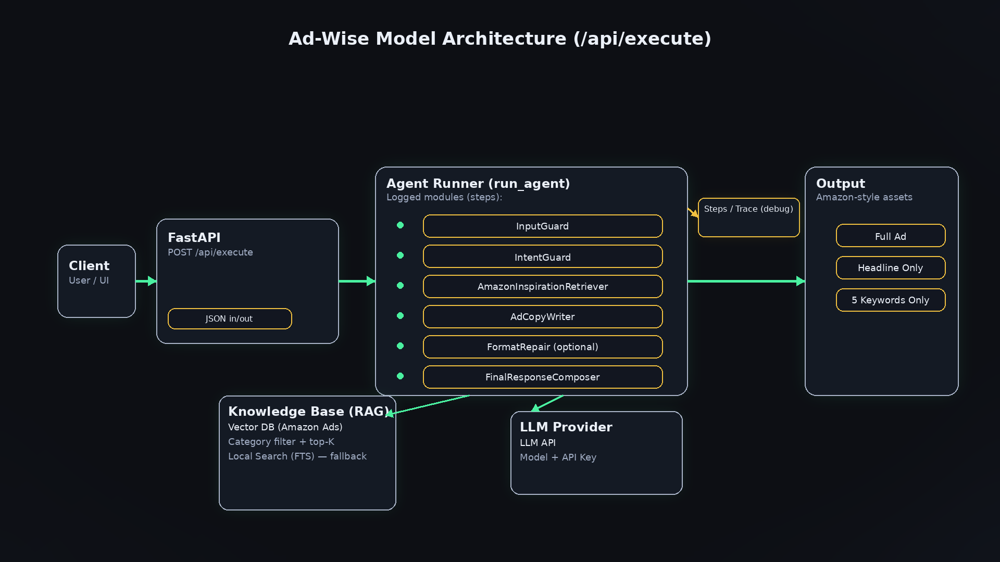

# Ad-Wise — AI-Powered Performance Ad Generator

> Generate high-converting e-commerce ad copy in seconds, powered by RAG over real product listing data.

**Live Demo:** https://ad-wise-agent.onrender.com  
**API Docs:** https://ad-wise-agent.onrender.com/docs

---

## What is Ad-Wise?

Ad-Wise is an AI agent that helps marketers and sellers create professional ad copy for e-commerce products. Given a product description, it retrieves inspiration from thousands of real product listings (via Pinecone vector search) and uses an LLM to generate three types of output:

| Mode | Output |
|------|--------|
| **Full Ad** | Headline + 5 bullet points + short description + keywords + publishing tips |
| **Headline Only** | One high-converting product headline (≤160 characters) |
| **5 Keywords** | Exactly 5 must-use keywords/phrases for the headline |

---

## Architecture

```
User Prompt
    │
    ▼
InputGuard          ← validates prompt length and detects output mode
    │
    ▼
IntentGuard         ← decides whether to clarify or proceed
    │
    ▼
AmazonInspirationRetriever  ← embeds query with MiniLM → Pinecone vector search
    │                          returns top-k real product listing examples
    ▼
AdCopyWriter        ← LLM generates ad copy grounded in retrieved examples
    │
    ▼
FinalResponseComposer  ← validates format, repairs if needed
    │
    ▼
Structured Response  { status, response, steps }
```



---

## Project Structure

```
ad-wise-agent/
├── app/
│   ├── main.py                 # FastAPI app, API endpoints
│   ├── agent.py                # Main pipeline (5-module chain)
│   ├── conversation_manager.py # Wizard UI conversation flow
│   ├── retriever.py            # Pinecone RAG + SQLite FTS fallback
│   ├── llm_client.py           # LLM API client
│   └── settings.py             # Environment variables & config
├── data/
│   ├── upload_data.py          # One-time script to upload CSV → Pinecone
│   └── con_to_text.py          # CSV preprocessing utility
├── static/
│   ├── index.html              # Chat UI frontend
│   └── architecture.png        # System architecture diagram
├── requirements.txt
└── .env                        # (not committed) API keys
```

---

## API Endpoints

### `POST /api/execute`
Main agent endpoint. Accepts a free-form prompt and returns generated ad copy with a full execution trace.

**Request:**
```json
{
  "prompt": "I'm selling a matte black 1L stainless steel water bottle. Write a full ad listing."
}
```

**Response:**
```json
{
  "status": "ok",
  "error": null,
  "response": "Headline: ...\nBullets:\n- ...",
  "steps": [
    { "module": "InputGuard", "prompt": {...}, "response": {...} },
    { "module": "IntentGuard", "prompt": {...}, "response": {...} },
    { "module": "AmazonInspirationRetriever", "prompt": {...}, "response": {...} },
    { "module": "AdCopyWriter", "prompt": {...}, "response": {...} },
    { "module": "FinalResponseComposer", "prompt": {...}, "response": {...} }
  ]
}
```

### `GET /api/team_info`
Returns team metadata.

### `GET /api/agent_info`
Returns agent description, prompt template, and 3 example prompts with expected outputs.

### `GET /api/model_architecture`
Returns the architecture diagram (PNG).

---

## Prompt Template

You can write naturally (free-form) or use this structured template:

```
Product: <describe the product>
Category: <optional>
RAG Category Filter: <optional>
Constraints: <optional>
Platform: E-commerce
Task: Full ad / Headline only / 5 keywords
```

### Example Prompts

**Full Ad:**
```
I'm selling a matte black 1-liter stainless steel insulated water bottle with a leak-proof lid.
It keeps drinks cold about 24 hours and hot around 12.
Can you write me a full ad listing (headline + bullets + short description + keywords + publishing tips)?
```

**Headline Only:**
```
Write headline only for a product listing: a wireless ergonomic mouse with silent clicks,
2.4GHz USB receiver, rechargeable battery, works on Windows and Mac. Headline only please.
```

**5 Keywords:**
```
Product: vitamin C face serum with hyaluronic acid — brightening + hydrating, fragrance-free,
for sensitive skin. Please give me 5 keywords only (comma separated) that I must include in the headline.
```

---

## Running Locally

### 1. Clone the repository
```bash
git clone https://github.com/Alaa4Saleh/ad-wise-agent.git
cd ad-wise-agent
```

### 2. Install dependencies
```bash
pip install -r requirements.txt
```

### 3. Create `.env` file
```
PINECONE_API_KEY=your_pinecone_api_key
PINECONE_INDEX_NAME=amazon-ads-index
PINECONE_NAMESPACE=amazon_ads
LLM_BASE_URL=your_llm_base_url
LLM_MODEL=your_model_name
```

### 4. Run the server
```bash
uvicorn app.main:app --reload --port 8000
```

### 5. Open in browser
- UI: http://localhost:8000
- API Docs: http://localhost:8000/docs

---

## Tech Stack

| Component | Technology |
|-----------|-----------|
| Backend | FastAPI + Uvicorn |
| Vector Search | Pinecone (gRPC) |
| Embeddings | `all-MiniLM-L6-v2` (sentence-transformers) |
| LLM | GPT-5-mini via LLMod API |
| Frontend | Vanilla HTML/CSS/JS |
| Deployment | Render |
